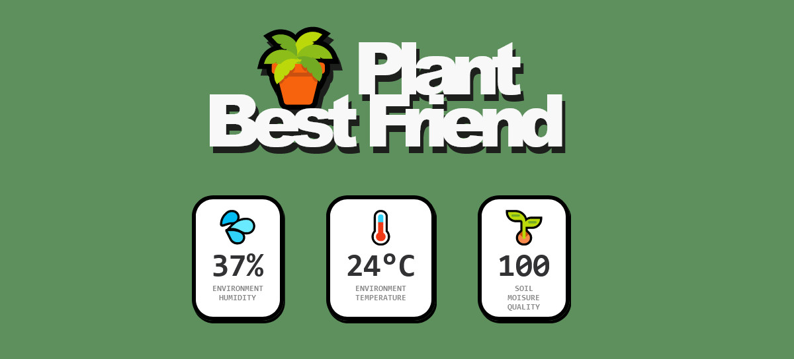

# ESP8266 Plant Best Friend

## Hardware
- ESP8266 esp-01
- Capacitive Moisture Sensor
- DHT11
- USB UART
- LiPo battery (temporary)

## Software
- Arduino IDE

## Tutorial

Read the complete tutorial at [bits.p1x.in](bits.p1x.in/plant-best-friend-esp8266-monitoring-part-1).

## Live Demo

If it has a power then it's available at [iot.p1x.in](https://iot.p1x.in/).

